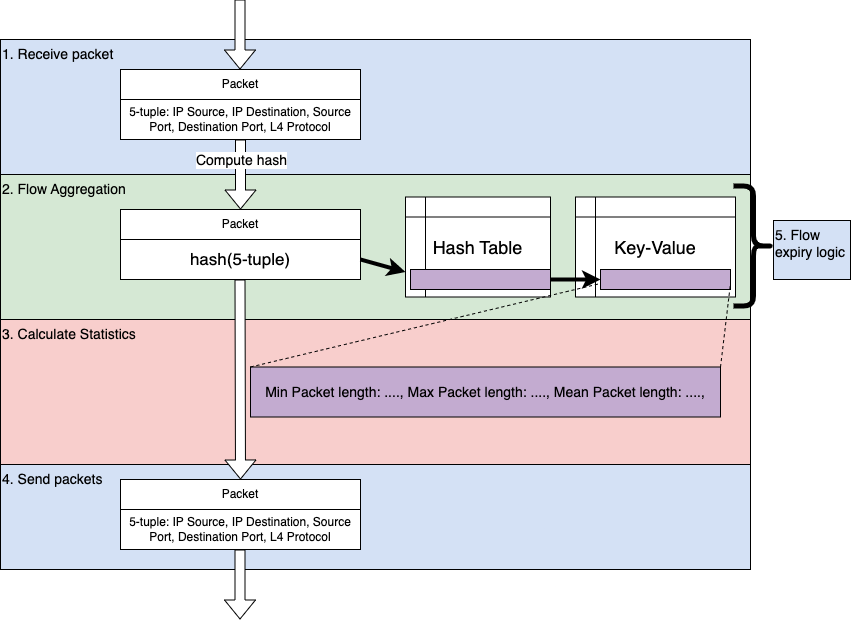
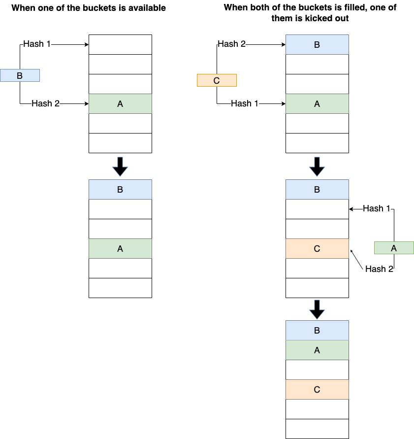

# l2fwd with flow-based statistics

This program builds upon DPDK's l2fwd sample application, written for my B. Eng. Final Year Project.
It forwards packets, while aggregating them into connections (5-tuple - src, dst addr and ports, protocol), and
calculating statistics such as:

- Total number of packets in flow
- Timestamp of first packet in the flow
- Timestamp of latest packet in the flow
Raw features
- Minimum, maximum, mean, and variance of packet
length
- Minimum, maximum, mean, and variance of timing
in between packets (packet interarrival time)
- TCP Flag counter (e.g., SYN, ACK, etc.)

### Overview

### Project structure

- `main.c` contains the basic port/queues configuration, and the main loop where packets are read and written to
rx/tx buffers.
- `analytics.c` contains the flow aggregation logic and statistics computation.

### Options

1. Hashing

Two methods of getting the hash of the 5-tuple can be configured.

Define HASH_CRC in analytics.h to configure hashing on the CPU, otherwise define HASH_RSS to extract the hash
generated by the hardware.

2. Data structure

Two different data structures are avaialable to store the flow entries.

- "naïve" hash table. No probing is done when a collision occurs. If a new flow
arrives and the corresponding bucket is already used, it would simply be discarded.
Provides fast lookup and insertion time, but does not fully utilize
the available memory space, and a significant number of flows get discarded.
Mainly intended as a baseline.

- "Cuckoo" hash table

A Cuckoo hash table works by involving two hash functions when inserting a new entry. As illustrated
below, when a new entry needs to be inserted, the two hash functions are
used to locate two possible buckets, and it is inserted into an empty one. If both
already contain entries, one of the existing entries is kicked out, and is moved to its
alternative bucket. The same process is repeated recursively if its alternative bucket
is also filled up.

Define DATA_STRUCTURE_NAIVE or DATA_STRUCTURE_CUCKOO to choose between these two options.